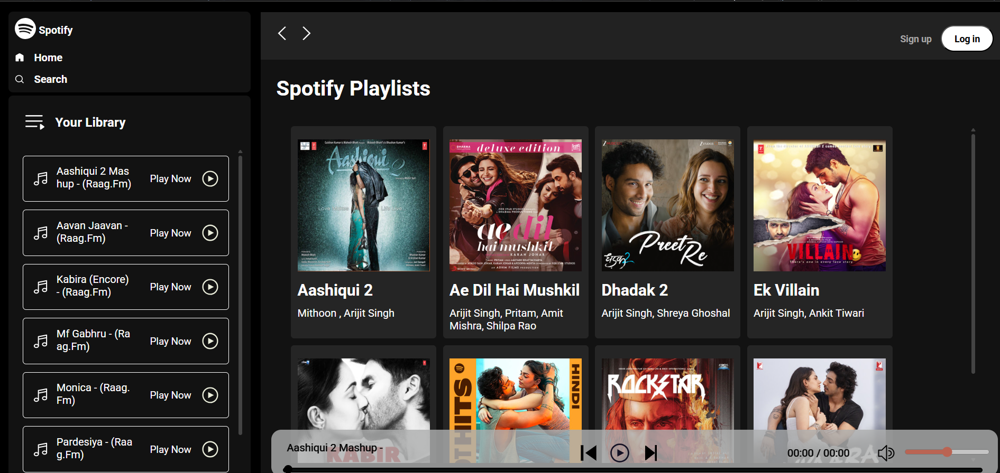

# 🎵 Spotify Clone

A web-based music player inspired by Spotify.  
Play, pause, skip, and control your favorite songs with a clean UI.



## 🚀 Features
- Play / Pause songs
- Next / Previous track
- Volume control & mute
- Seekbar with progress
- Albums & playlists

## 🛠️ Tech Stack
- HTML, CSS, JavaScript
- Node.js + Express (for serving songs)

## ⚡ Installation
```bash
git clone https://github.com/Parikshitexe/SpotifyClone.git
cd SpotifyClone
# run local server
npm install
npm start
